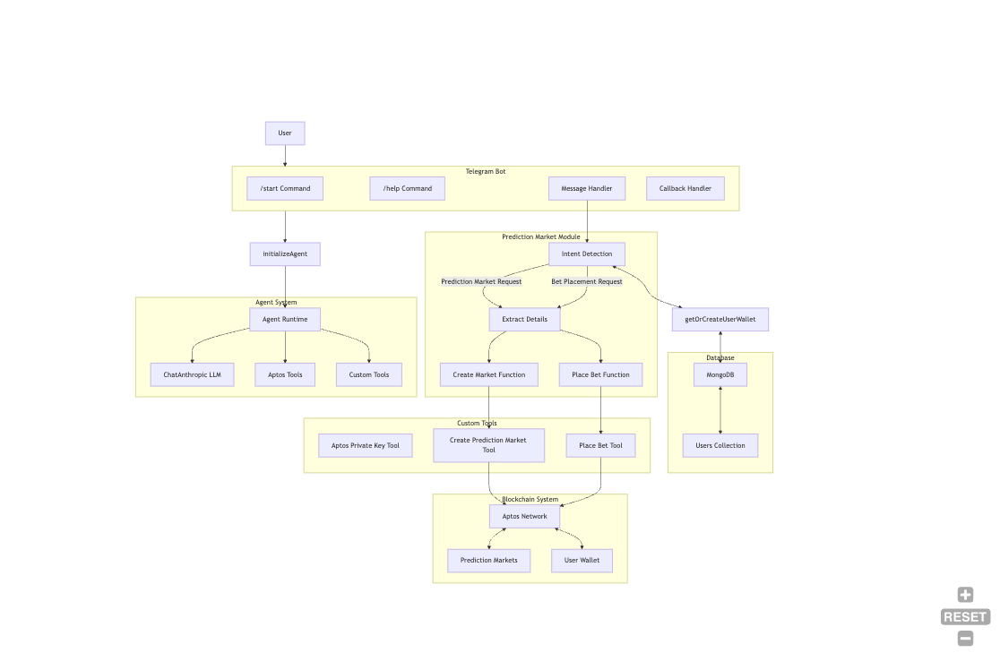

# Predikto - Telegram Prediction Market Bot

Predikto is a Telegram bot that allows users to create and participate in prediction markets on the Aptos blockchain. This project combines the power of AI with blockchain technology to enable decentralized betting on future events.

## Features

- **Create Prediction Markets**: Users can create markets about any future event by simply describing it in natural language
- **Aptos Blockchain Integration**: All markets are created on-chain for transparency and security
- **AI-Powered Interaction**: Uses Claude AI to understand user intent and extract prediction details
- **Wallet Management**: Create new Aptos wallets or import existing ones
- **Transaction Tracking**: View your prediction market transactions on Aptos Explorer

## How It Works

1. **Start the Bot**: Use the `/start` command to create or import an Aptos wallet
2. **Create a Market**: Simply mention betting-related keywords along with what you want to bet on
   - Example: "Let's bet on whether BTC will reach $200k by the end of the year"
3. **AI Processing**: The bot extracts the question, description, and end date from your message
4. **On-Chain Creation**: The prediction market is created on the Aptos blockchain
5. **Place Bets**: Users can place bets on the outcome (Yes/No)

## Technical Stack

- **Frontend**: Telegram Bot API
- **Backend**: Next.js API routes
- **Blockchain**: Aptos (Testnet)
- **AI**: Claude 3.5 Sonnet via Anthropic API
- **Agent Framework**: Move Agent Kit & LangChain
- **Database**: MongoDB for user wallet management

## Quick Deploy

[](https://vercel.com/new/clone?repository-url=https%3A%2F%2Fgithub.com%2FMetaMove%2Ftg-bot-starter%2Ftree%2Fmain%2Fadvanced-tg-bot&env=ANTHROPIC_API_KEY,PANORA_API_KEY,TELEGRAM_BOT_TOKEN,NEXT_PUBLIC_FIREBASE_API_KEY,NEXT_PUBLIC_FIREBASE_AUTH_DOMAIN,NEXT_PUBLIC_FIREBASE_PROJECT_ID,NEXT_PUBLIC_FIREBASE_STORAGE_BUCKET,NEXT_PUBLIC_FIREBASE_MESSAGING_SENDER_ID,NEXT_PUBLIC_FIREBASE_APP_ID,NEXT_PUBLIC_FIREBASE_MEASUREMENT_ID&project-name=advanced-tg-bot&repository-name=advanced-tg-bot)

## Setup Instructions

1. Set environment variables:

   - `TELEGRAM_BOT_TOKEN`: Your Telegram bot token
   - `ANTHROPIC_API_KEY`: API key for Claude AI
   - `PANORA_API_KEY`: API key for Panora
   - `NEXT_PUBLIC_MONGO_URL`: MongoDB connection string

2. Install dependencies:

   ```
   pnpm install
   ```

3. Run the development server:

   ```
   pnpm run dev
   ```

4. Set up webhook for your Telegram bot:
   - Use ngrok or similar tool to expose your local server
   - Set the webhook URL to `https://your-url.app/api/bot`
   - Example: `curl https://api.telegram.org/bot<YOUR_BOT_TOKEN>/setWebhook?url=https://your-url.app/api/bot`

## Smart Contract

The project uses a Move smart contract on Aptos for managing prediction markets. The contract handles:

- Market creation with question, description, and end time
- Placing bets on outcomes (Yes/No)
- Resolving markets and distributing winnings
- Viewing market information and user positions

## Contract Structure

The prediction market contract consists of the following key components:

### Data Structures

- `Market`: Stores market details including question, description, end time, betting amounts, and outcome
- `UserPosition`: Tracks a user's bets in a specific market
- `PredictionMarketState`: Global state containing all markets and user positions

### Key Functions

- `create_market`: Creates a new prediction market with specified parameters
- `place_bet`: Allows users to place bets on Yes/No outcomes
- `resolve_market`: Resolves a market with the final outcome
- `claim_winnings`: Allows winners to claim their rewards
- `get_market_data`: View function to retrieve market information
- `get_user_position`: View function to check a user's position in a market



## Contributing

Contributions are welcome! Feel free to submit issues or pull requests to improve the project.

## License

MIT
